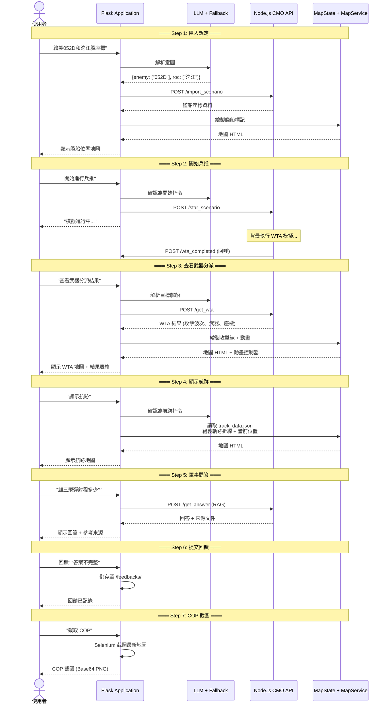

```mermaid
sequenceDiagram
    actor User as 使用者
    participant App as Flask Application
    participant LLM as LLM + Fallback
    participant API as Node.js CMO API
    participant Map as MapState + MapService

    Note over User,Map: ═══ Step 1: 匯入想定 ═══
    User->>App: "繪製052D和沱江艦座標"
    App->>LLM: 解析意圖
    LLM-->>App: {enemy: ["052D"], roc: ["沱江"]}
    App->>API: POST /import_scenario
    API-->>App: 艦船座標資料
    App->>Map: 繪製艦船標記
    Map-->>App: 地圖 HTML
    App-->>User: 顯示艦船位置地圖

    Note over User,Map: ═══ Step 2: 開始兵推 ═══
    User->>App: "開始進行兵推"
    App->>LLM: 確認為開始指令
    App->>API: POST /star_scenario
    App-->>User: "模擬進行中..."

    Note over API: 背景執行 WTA 模擬...
    API->>App: POST /wta_completed (回呼)

    Note over User,Map: ═══ Step 3: 查看武器分派 ═══
    User->>App: "查看武器分派結果"
    App->>LLM: 解析目標艦船
    App->>API: POST /get_wta
    API-->>App: WTA 結果 (攻擊波次、武器、座標)
    App->>Map: 繪製攻擊線 + 動畫
    Map-->>App: 地圖 HTML + 動畫控制器
    App-->>User: 顯示 WTA 地圖 + 結果表格

    Note over User,Map: ═══ Step 4: 顯示航跡 ═══
    User->>App: "顯示航跡"
    App->>LLM: 確認為航跡指令
    App->>Map: 讀取 track_data.json<br/>繪製軌跡折線 + 當前位置
    Map-->>App: 地圖 HTML
    App-->>User: 顯示航跡地圖

    Note over User,Map: ═══ Step 5: 軍事問答 ═══
    User->>App: "雄三飛彈射程多少?"
    App->>API: POST /get_answer (RAG)
    API-->>App: 回答 + 來源文件
    App-->>User: 顯示回答 + 參考來源

    Note over User,Map: ═══ Step 6: 提交回饋 ═══
    User->>App: 回饋: "答案不完整"
    App->>App: 儲存至 /feedbacks/
    App-->>User: 回饋已記錄

    Note over User,Map: ═══ Step 7: COP 截圖 ═══
    User->>App: "截取 COP"
    App->>App: Selenium 截圖最新地圖
    App-->>User: COP 截圖 (Base64 PNG)
```