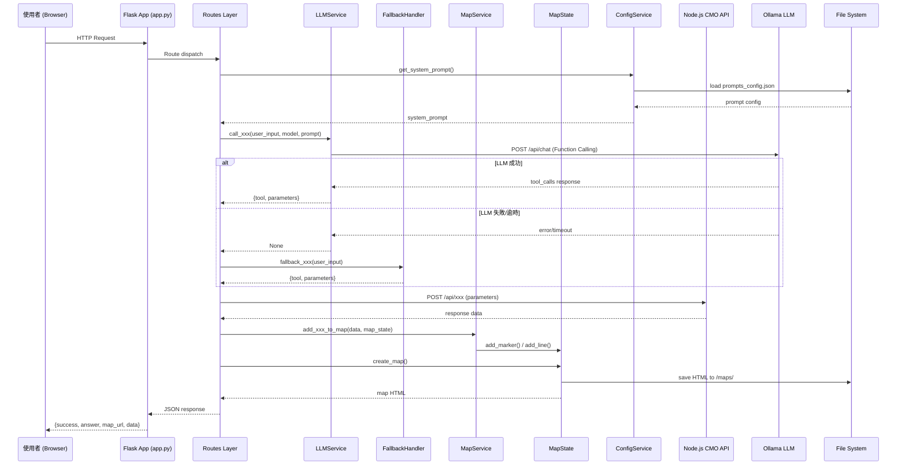
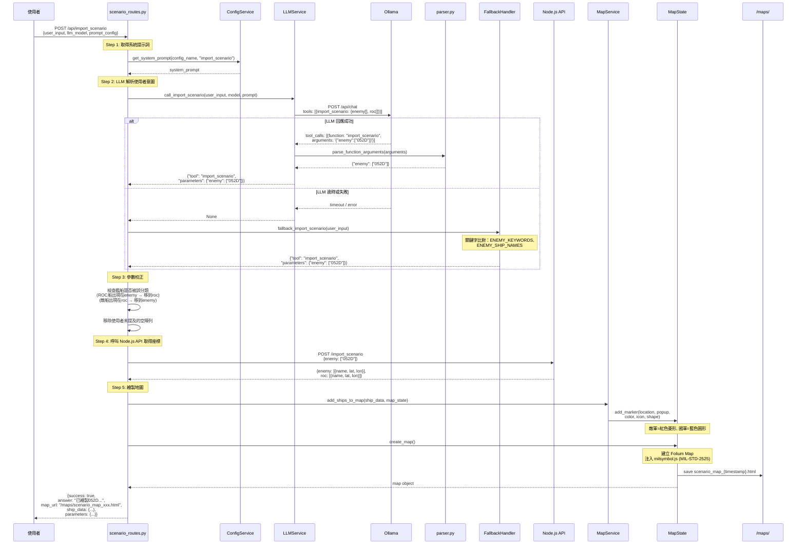
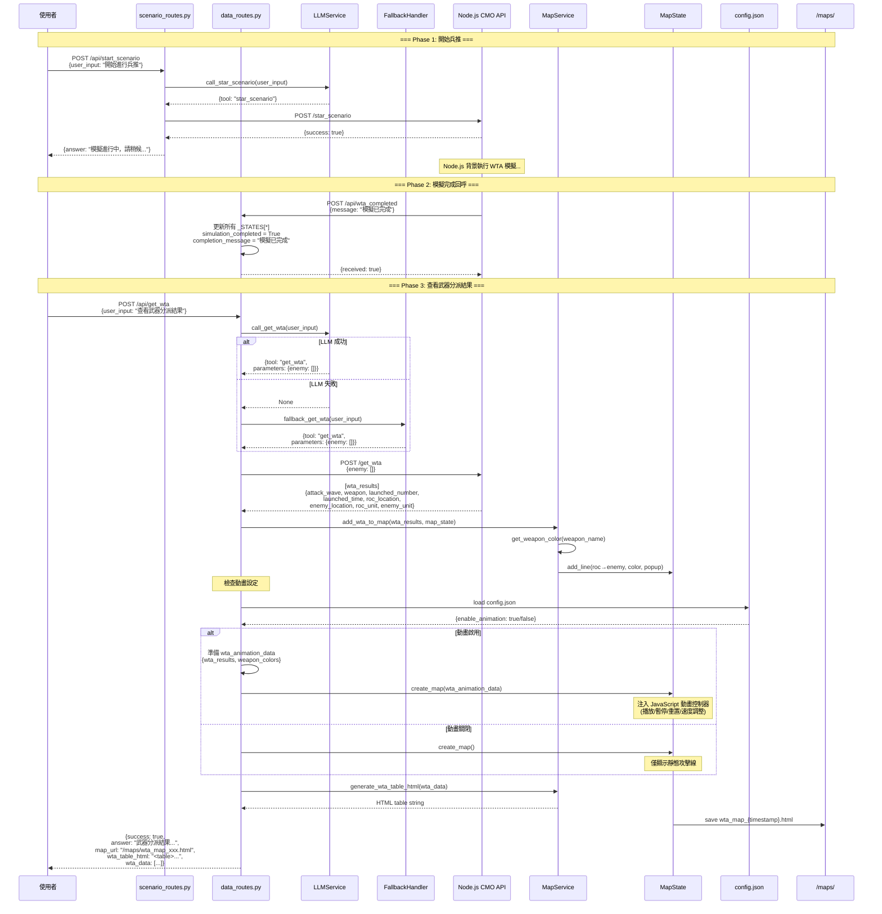
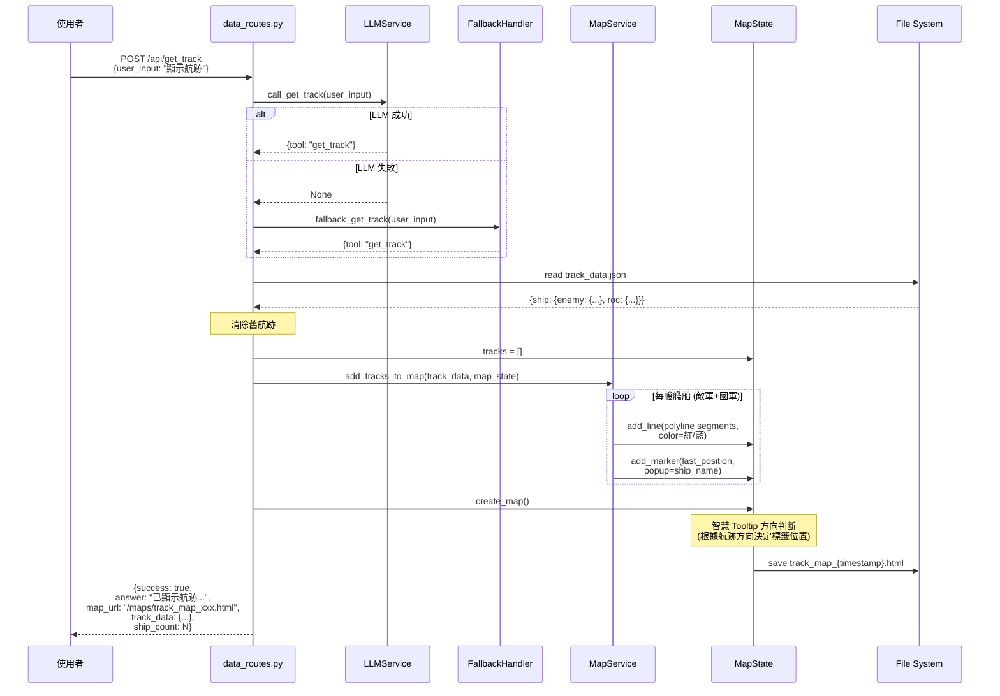
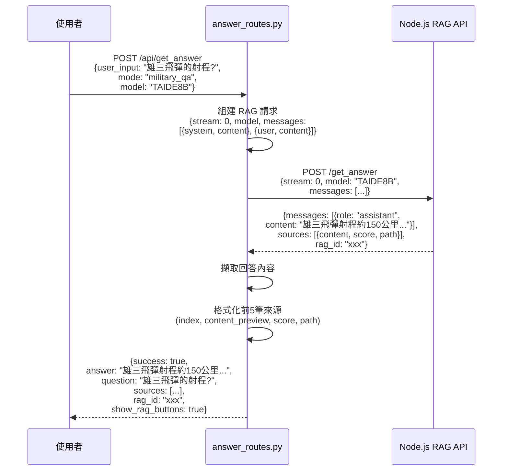
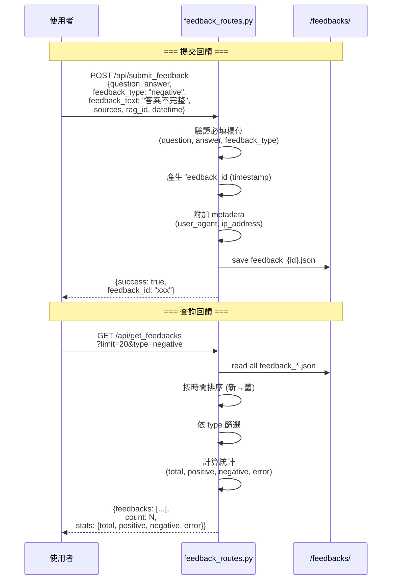
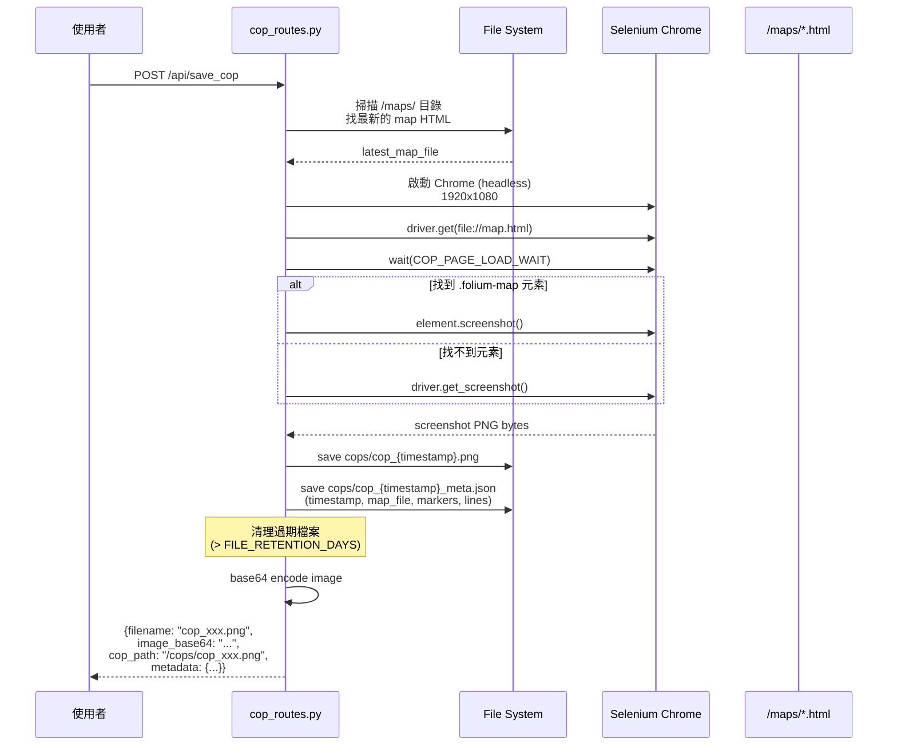
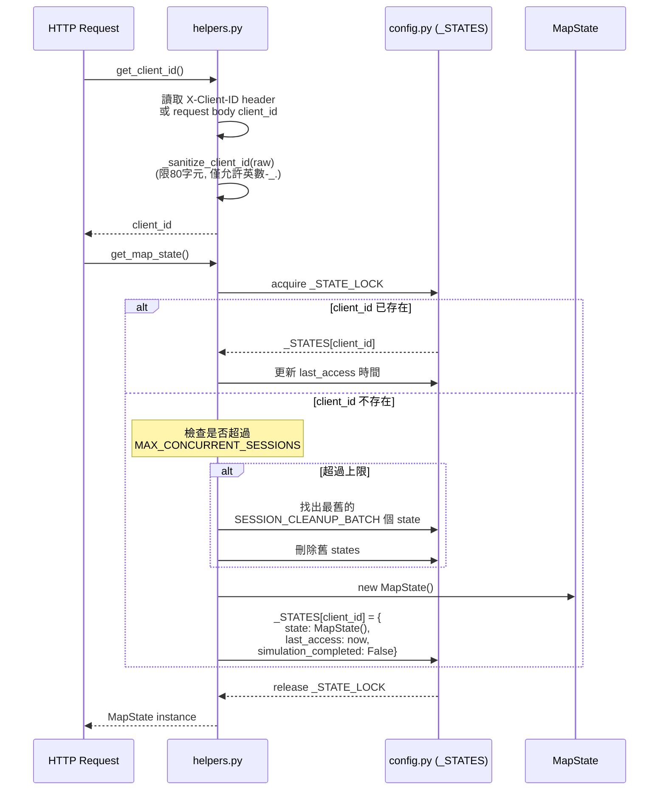
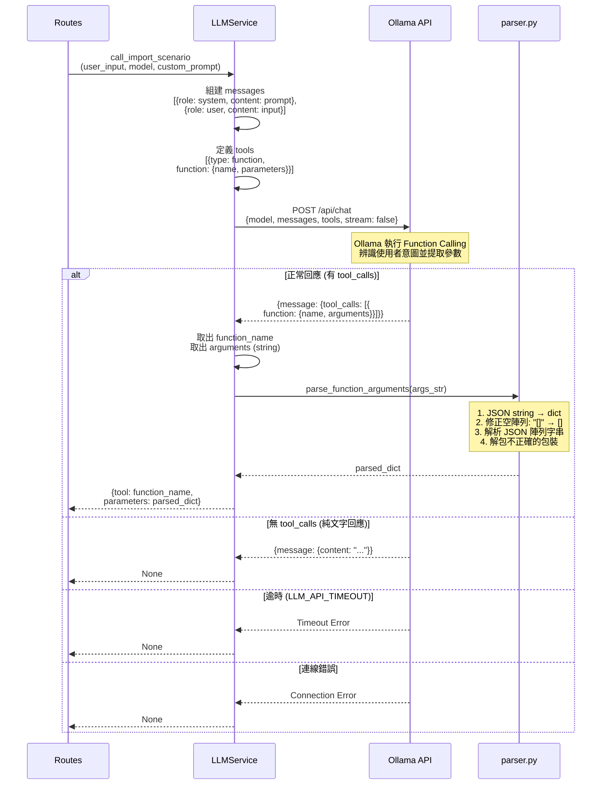
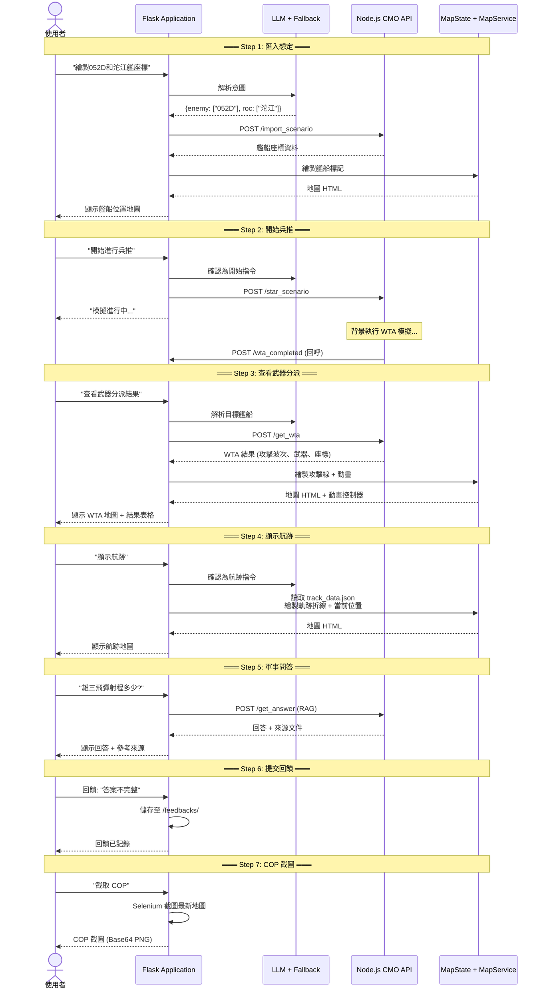

# Sequence Diagrams - 軍事兵推 AI 系統

## 1. 整體系統架構互動總覽

---

## 2. 匯入想定 (Import Scenario) - 繪製艦船座標

---

## 3. 開始兵推 → WTA 完成 → 查看武器分派

---

## 4. 顯示航跡 (Get Track)

---

## 5. RAG 軍事問答 (Get Answer)

---

## 6. 使用者回饋 (Feedback)

---

## 7. COP 截圖 (Save COP)

---

## 8. Session 管理 & 狀態隔離

---

## 9. LLM Function Calling 詳細流程

---

## 10. 完整使用者操作流程 (End-to-End)

